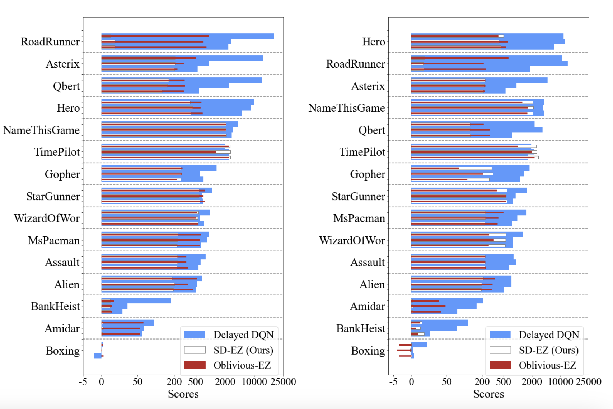

# Delayed-EfficientZero (ICLR 2024)
Open-source codebase for the Delayed-EZ, from TREE SEARCH-BASED POLICY OPTIMIZATION UNDER
STOCHASTIC EXECUTION DELAY.
*David Valensi, Esther Derman, Shie Mannor, Gal Dalal*

## Environments
SD-EZ builds upon EfficientZero and requires python3 (>=3.6) and pytorch (>=1.8.0) with the development headers. 

We recommend to use torch amp (`--amp_type torch_amp`) to accelerate training.

### Prerequisites
Before starting training, you need to build the c++/cython style external packages. (GCC version 7.5+ is required.)
```
cd core/ctree
bash make.sh
``` 
The distributed framework of this codebase is built on [ray](https://docs.ray.io/en/releases-1.0.0/auto_examples/overview.html).

### Installation
As for other packages required for this codebase, please run `pip install -r requirements.txt`.

## Usage
### Quick start
* Train: `python main.py --env BreakoutNoFrameskip-v4 --case atari --opr train --amp_type torch_amp --num_gpus 1 --num_cpus 10 --cpu_actor 1 --gpu_actor 1 --force`
* Train: `python main.py --env BreakoutNoFrameskip-v4 --case atari --opr train --amp_type torch_amp --num_gpus 1 --num_cpus 10 --cpu_actor 1 --gpu_actor 1 --force --steps_transitions 130000 --delay 15 --use_forward --stochastic_delay`
* Test: `python main.py --env BreakoutNoFrameskip-v4 --case atari --opr test --amp_type torch_amp --num_gpus 1 --load_model --model_path model.p --delay 5 --use_forward \`
### Bash file
We provide `train.sh` and `test.sh` for training and evaluation.
* Train: 
  * With 2 GPUs (10GB): `bash train.sh`
* Test: `bash test.sh`

| Required Arguments            | Description                                                       |
|:------------------------------|:------------------------------------------------------------------|
| `--env`                       | Name of the environment                                           |
| `--case {atari}`              | It's used for switching between different domains(default: atari) |
| `--opr {train,test}`          | select the operation to be performed                              |
| `--amp_type {torch_amp,none}` | use torch amp for acceleration                                    |

|Other Arguments | Description|
|:-------------|:-------------|
| `--force`                           |will rewrite the result directory
| `--num_gpus 4`                      |how many GPUs are available
| `--num_cpus 96`                     |how many CPUs are available
| `--cpu_actor 14`                    |how many cpu workers
| `--gpu_actor 20`                    |how many gpu workers
| `--seed 0`                          |the seed
| `--use_priority`                    |use priority in replay buffer sampling
| `--use_max_priority`                |use the max priority for the newly collectted data
| `--amp_type 'torch_amp'`            |use torch amp for acceleration
| `--info 'EZ-V0'`                    |some tags for you experiments
| `--p_mcts_num 8`                    |set the parallel number of envs in self-play 
| `--revisit_policy_search_rate 0.99` |set the rate of reanalyzing policies
| `--use_root_value`                  |use root values in value targets (require more GPU actors)
| `--delay 5`                   | use an execution delay of 5 in the env                            |
| `--use_forward`               | use dynamics model to estimate future state                       |
| `--stochastic_delays`         | modify the delays value every timestep with probability 0.2       |
| `--render`                          |render in evaluation
| `--save_video`                      |save videos for evaluation
 
## Architecture Designs
The architecture of the training pipeline is shown as follows:

## Results 
Evaluation with 32 seeds for 2 different runs (different seeds).


```


## Acknowledgement
This repo is a fork of
https://github.com/YeWR/EfficientZero
